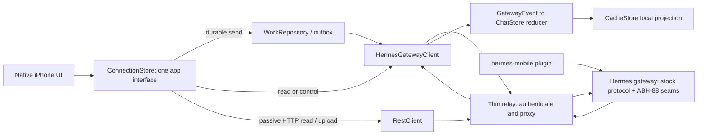
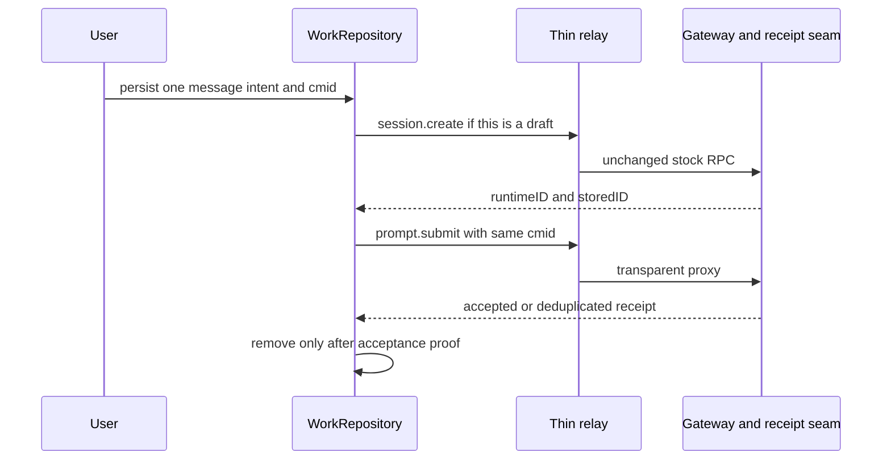

# ABH-519 — amended v0.19 mobile simplification plan

**Status:** discussion/audit plan after independent review; no product implementation is included.

**Branch:** `codex/abh-519-v019-simplification-note`.

**Evidence:** `docs/CODEX-ABH519-ROUND2-HANDOFF.md`,
`docs/CODEX-ABH519-V019-SIMPLIFICATION-REVIEW.md`, `CONTRACT-DEPATCH.md`,
`docs/INTERACTION-CONTRACT.md`, ABH-519, ABH-516, ABH-88.

## Decision

Keep the transport simplification. Withdraw the claim that the product can use an untouched
v0.19 gateway with public hooks only.

The correct target is:

> one stock gateway protocol, one phone transcript reducer, one durable phone outbox, a
> transparent relay, and the existing Hermes mobile plugin on a small, explicit, shrinking
> ABH-88 seam ledger.

This is still deletion-heavy. It removes the relay transcript/reframer/item protocol that caused
Q1/Q2/Q3. It does **not** remove the few gateway seams required for the owner's real workflows:
desktop-to-phone live follow, turn-level push, durable submit receipts, device auth, live delete,
and pending interactions.

The gateway is therefore not literally pristine today. It is a pristine upstream base plus the
named seams below, each kept generic and shaped for upstreaming. No mobile transcript logic belongs
in gateway core.

## Evidence rerun on 2026-07-22

The review's commands were rerun in this worktree against tag `v2026.7.20`:

| Check | Reproduced result |
|---|---|
| v0.19 tag commit | `3ef6bbd201263d354fd83ec55b3c306ded2eb72a` |
| merge-base with build 120 | `306e2d2318745b48d0c9d249958b0190f65a07c9` |
| fork commits after merge-base | 524 |
| v0.19 commits after merge-base | 987 |
| v0.19 ancestor of build 120 | no (`merge-base --is-ancestor` exit 1) |
| `gateway/delivery_ledger.py` on build 120 | absent |
| v0.19 `delivery_ledger` references | 19 |
| plugin seam uses | `pre_emit_event` 3, `post_emit_event` 6, `post_frame_write` 4, `on_ws_transport_change` 4, receipt provider 1 |
| those five seams in v0.19 | 0 each |
| `client_message_id` in v0.19 | 0 |
| `steer` in v0.19 | 820 references |
| `on_session_finalize` in v0.19 | 78 references |

Two additional tag-level findings amend both earlier documents:

1. `session.resume` on an already-live session calls `_live_session_payload(...,
   transport=current_transport())`, which assigns `session["transport"]` to the caller. A phone
   must not use resume merely to look at a desktop-owned live session.
2. v0.19 has a read-only structured `session.active_list` returning runtime `id`, stored
   `session_key`, and `status` without rebinding transport. That is enough to identify a live
   session before choosing drive or watch. The ABH-88 S12 status seam is no longer required for
   this decision.

Reproduce the additional findings:

```sh
git show v2026.7.20:tui_gateway/server.py | sed -n '6200,6260p;6659,6720p'
git grep -n '@method("session.active_list")' v2026.7.20 -- tui_gateway/server.py
git show v2026.7.20:tui_gateway/server.py | sed -n '11380,11470p;11620,11710p;12420,12460p'
git grep -n '_emit("message.start"' v2026.7.20 -- tui_gateway/server.py
```

## Root cause and retained complexity

Build 120's confirmed failures remain:

- Q1: assistant persistence was keyed/written through the wrong copy of session identity.
- Q2: the relay guessed an unseen text delta was a tool item.
- Q3: stored/runtime IDs diverged after the relay-specific seed binding was removed.

All three are copy-divergence bugs. The gateway, relay, and phone each modeled the conversation.
The fix is to delete the relay's model, not repair each disagreement.

Identity itself does not disappear. It gets one owner on the phone:

```text
SessionBinding {
  storedID    // cache, drawer, deep links, durable outbox
  runtimeID   // live RPCs and event routing
  mode        // drive or watch
  generation  // the phone socket generation that owns a drive binding
}
```

This should be an existing session-state value, not a new manager or database. Contract tests must
enforce that durable data is keyed only by `storedID` and live commands only by `runtimeID`.

## Target architecture



`HermesGatewayClient` and `RestClient` are implementation details behind `ConnectionStore`, not two
product paths. WebSocket owns create/resume/submit/live controls/events. HTTP owns pairing,
uploads, passive or paginated transcript reads, and plugin routes. Both use one relay address.

The relay owns TLS ingress, phone authentication, gateway routing, transparent WS/HTTP proxying,
connection lifetime, and backpressure. It owns no transcript, item vocabulary, session history,
runtime/stored translation, replay engine, or submit receipt database.

The plugin is not a network hop. It observes and extends the gateway at the edge. CacheStore is an
offline projection; the gateway remains conversation truth.

## Drive versus watch

The phone must never call `session.resume` blindly on open.

```mermaid
stateDiagram-v2
    [*] --> Inspect: select storedID and paint cache
    Inspect --> Drive: no active runtime; call session.resume
    Inspect --> Drive: binding was created or claimed on this socket generation
    Inspect --> Watch: active_list finds runtime owned elsewhere or from an older generation
    Watch --> Watch: receive S1 fan-out and passive transcript refresh
    Watch --> Drive: explicit phone send after outbox persistence rebinds prompt.submit
    Watch --> Drive: active runtime disappears; resume before draining queued work
    Drive --> Watch: phone reconnects; prior generation is no longer assumed owner
```



Concrete open algorithm:

1. At selection intent, bind the selected `storedID` and paint only that cache partition.
2. Reuse a drive binding only when it was created/resumed/submitted on the current socket
   generation.
3. Otherwise call stock `session.active_list`, which is read-only.
4. If it reports the stored ID, enter watch mode with its runtime ID. Seed/reconcile through one
   passive transcript read and accept S1 fan-out. Do not call `session.resume` or
   `session.activate`.
5. If it does not report the stored ID, call `session.resume` once and enter drive mode.
6. A send from watch mode is an explicit ownership action. WorkRepository holds the prompt;
   `prompt.submit` against the observed runtime moves drive ownership to the phone. S1 fan-out
   keeps the desktop informed. If that runtime vanished, refresh `active_list`, resume once, then
   drain the same outbox row.
7. Reconnect invalidates only the local drive assertion, not the transcript. Re-inspect before
   resuming.

This uses stock v0.19's structured liveness source and S1 fan-out. It does not need polling during a
healthy foreground watch, does not steal a desktop turn, and does not add a subscription protocol.

One stock gap remains explicit: `message.start` carries no user text. For a newly observed foreign
turn, retain the existing one-shot `mergeForeignUserRows` tail read to insert the durable user row,
then reconcile once at completion. This is a bounded read from gateway truth, not a relay item or a
second transcript. A later generic upstream change that includes the submitted user text in
`message.start` can delete that read.

## Turn-level push

`on_session_finalize` is session teardown, not turn completion. Sessions last for hours, so it
cannot drive completion notifications.

The retained design is:

| Product event | Source |
|---|---|
| turn complete/error | S2 `post_emit_event` observing `message.complete` / `error` |
| clarify | S2 observing `clarify.request` |
| approval | stock `pre_approval_request` hook |
| Live Activity teardown | stock `on_session_finalize` plus the minimum identity available |

Suppression must be device-specific. A desktop owning the gateway transport must not suppress a
push to a disconnected phone. The plugin should use its authenticated device/socket registry to
skip only the phone device that is actively foregrounding that stored session.

Push work stays asynchronous and non-fatal. The relay does not wait for or store turn completion.

## Submit durability and idempotency

Every user message, online or offline, enters WorkRepository first with one stable
`client_message_id`.



v0.19 has no submit idempotency key. Keep S11 and the plugin-owned receipt SQLite until a generic
upstream `prompt.submit` idempotency key lands. On ambiguous transport failure, first reconcile the
receipt/tail, then retry the same cmid. Do not use content matching and do not move receipts into
the relay.

## v0.19 protocol map

The existing direct client is reusable, but not unchanged. Its typed contract must be reconciled
against both the current fork gateway and v0.19 before it becomes the sole path.

| RPC/event | Verified v0.19 shape or behavior | Phone rule |
|---|---|---|
| `session.create` | returns runtime `session_id`, stable `stored_session_id`, `messages`, `message_count`, `info` | store both IDs; decode `messages` |
| `session.resume` | returns runtime `session_id`, stored target in `resumed`/`session_key`, full `messages`, `running`, `status`, optional `inflight`/`queued` | drive only; never use as a passive read |
| `session.active_list` | read-only list with runtime `id`, stored `session_key`, structured `status` | drive/watch preflight |
| `session.status` | v0.19 returns human `output` only | do not parse prose for liveness |
| `prompt.submit` | returns `{"status":"streaming"}` and rebinds transport to caller | acceptance needs retained S11 when cmid is present |
| `message.start/delta/complete` | authoritative assistant turn stream; `message.start` has no user payload | existing raw reducer; one tail read supplies a foreign prompt; completion persists settled text |
| `thinking.delta`, `reasoning.delta` | transient display stream | render live; no durable replay promise |
| `tool.start/complete`, `status.update` | structured activity | render live; cache only settled transcript requirements |
| `approval.request`, `clarify.request`, `sudo.request`, `secret.request` | interactive events | route by explicit runtime ID; pending recovery via S13/plugin snapshot |
| `error`, `session.info` | terminal error and runtime metadata | clear live state / update composer metadata |
| `subagent.start/thinking/tool/complete` | stock subagent activity | keep current raw event support; unknown additions are isolated |

Current `SessionOpenResult` does not decode the returned `messages` array. That omission must be
fixed in the narrow client adapter; otherwise the plan would repeat the same ignored-history bug
under a different transport.

v0.19 also emits newer optional events such as `message.interim`, `reasoning.available`,
`tool.generating`, `tool.output_risk`, MoA, notice, reaction, voice, and preview/browser progress.
They must decode as isolated unknown events rather than fail the stream. Add them only when a
specific native surface needs them; basic chat does not require a second item language.

## ABH-88 seam re-verdict against v0.19

| Seam | Amended verdict | Reason |
|---|---|---|
| S1 event fan-out / transport lifecycle | KEEP | stock routes a session to one owner transport; desktop/phone live follow needs bounded fan-out |
| S2 event transform/observer | KEEP, minimize | turn/clarify push and stable correlation need turn-level event observation |
| S3 runtime metadata at finalize | RETIRE as identity system | v0.19 already carries stored/runtime IDs in RPCs; keep only a tiny generic finalize metadata addition if LA cleanup cannot derive it safely |
| S4 session-scoped reasoning/fast | SUPERSEDED by v0.19 | verified `config.set/get` now holds session-scoped reasoning and `create_service_tier_override` |
| S5 device auth/socket lifecycle | KEEP minimum | stock token providers cover allowlisted REST, not device WS identity, revocation, scopes, and device-specific push suppression |
| S6 live session delete | KEEP pending upstream | v0.19 still returns 4023 for active sessions |
| S7 WS owner-write queue | SUPERSEDED | v0.19 has loop-owned writes and delta coalescing |
| S8 `exclude_sources` | SUPERSEDED | present in v0.19 state and HTTP listing paths |
| S9 desktop foreign-frame core adoption | OBSOLETE | phone routes broadcast frames by the existing stored ID; no desktop core adoption patch |
| S10 old REST/embedded delete guards | OBSOLETE | use S6 and stock guards |
| S11 prompt receipt provider | KEEP pending upstream | no `client_message_id` exists in v0.19 |
| S12 structured `session.status` | DROP from this plan | stock `session.active_list` supplies drive/watch liveness; model comes from `info`, usage from completion events |
| S13 pending interaction snapshots/resolver | KEEP minimum | required for phone recovery/response to pending approval/clarify state |

This leaves S1, S2, S5, S6, S11, and S13, with a possible tiny finalize-metadata residue from S3.
Every one must remain plugin-neutral, tested with the plugin disabled, and tracked as an upstream PR
candidate. Re-run this ledger on every upstream sync and delete a seam as soon as upstream covers
its contract.

## Interaction contract and tests

`docs/INTERACTION-CONTRACT.md` remains the behavioral oracle, not its relay-item implementation.
I1-I23 must be translated to stock-event terms where the old document names `RelayItemStore`,
relay snapshots, relay dedup, or relay-owned reconnect.

Required test work:

- preserve identity isolation, cache-first paint, selection epochs, one echo, chronology,
  idempotency, liveness, explicit targeting, paging, and kill/relaunch behavior;
- replace relay-frame render fixtures with recorded stock `GatewayEvent` fixtures;
- add drive/watch tests proving passive open never changes the gateway owner transport;
- retain the migrated device-shaped cache DB test (116 -> 119/120), not only fresh schemas;
- run contract probes against both the current fork and v0.19 so protocol drift is explicit;
- keep unknown-event isolation tests;
- require physical-device logging for the release gate.

## Migration sequence

Do not make a gateway tag swap a prerequisite for fixing the phone.

1. Freeze/cancel Round 4 Waves 3-4 that delete `HermesGatewayClient`, `GatewayEvent`, and the raw
   ingestors.
2. Add protocol contract tests for the current fork and v0.19; make the existing client decode the
   verified intersection and returned history.
3. Add a transparent proxy lane to an isolated relay/gateway on port 9130+. No relay transcript or
   custom chat RPCs.
4. Route the phone's existing direct WS/HTTP clients through that relay address.
5. Put every send through WorkRepository and S11; implement explicit create then submit for drafts.
6. Implement drive/watch using `session.active_list`, current-generation bindings, S1 fan-out, one
   passive open refresh, and the existing one-shot foreign-user tail read.
7. Route raw events through the existing GatewayEvent to ChatStore reducer; persist settled
   user/assistant text to CacheStore by stored ID.
8. Prove new chat, switch, watch, push, offline drain, reconnect, and force-close on the physical
   iPhone before deleting anything.
9. Delete RelayClient, RelayItemStore, Reframer, relay session/transcript accumulators, their custom
   vocabulary, relay dedup, and relay chat-state tables. Remove dual-write tests instead of keeping
   two paths alive.
10. Independently sync the gateway to v0.19/newer using the ABH-88 seam ledger and repeat the same
    device gate. Upstream sync and mobile transport deletion are separate blast radii.

## Physical-device acceptance

- New chat creates once, sends once, and streams a normal assistant reply.
- Created stored ID receives the cache write; switch-back and force-close/reopen paint the same
  transcript from disk.
- Opening a desktop-owned live session enters watch mode and does not change its owner transport.
- The phone sees the desktop turn live through S1, including the user row and final assistant text.
- Sending deliberately from that watched chat changes ownership once and both clients still see the
  turn through fan-out.
- Desktop-originated `message.complete`, clarify, and approval produce phone push at turn/gate time;
  session finalize is used only for teardown.
- An actively foregrounded phone suppresses only its own redundant push; a connected desktop does
  not suppress phone push.
- An ambiguous submit retries the same cmid and produces one gateway turn and one bubble.
- A deliberately unavailable cache performs one authoritative read and never paints another
  session's rows.
- Offline send drains once; permanent transcript recovers after reconnect; transient reasoning/tool
  cards may reset.
- Load earlier fetches one older page even while a turn streams.
- Live delete, attachments, approval, clarify, interrupt, steer, model/reasoning/fast, and cwd work
  through the transparent relay.
- The migrated 116 -> 119/120 DB harness passes, and device logs—not simulator-only XCTest—show the
  same IDs at create, submit, event, cache write, switch, and reopen.

## Guardrails

- No relay transcript/session database or second event vocabulary.
- No semantic replay or raw-frame replay.
- No content-based submit deduplication.
- No blind resume of an active session.
- No permanent direct/relay dual chat implementations.
- No new coordinator/manager for identity; one small phone-owned binding value is enough.
- Plugin failure and cache failure stay non-fatal to gateway truth.
- Core differences are limited to the re-verdict seam ledger and shrink on upstream sync.
- No fifth simulator-green/device-broken patch.

## Final disposition of the review

All eight requested amendments are incorporated:

1. ABH-88 is the seam posture, with a new v0.19 re-verdict.
2. Drive/watch is explicit and passive open cannot resume-steal.
3. The tag protocol map names response shapes and event handling.
4. Push is turn-level through S2, not finalize-level.
5. S11 receipts remain until upstream idempotency exists.
6. Mobile proxy migration precedes and is independent from upstream sync.
7. I1-I23, stock-event fixtures, migrated DB, and device evidence form the test story.
8. Round 4 Waves 3-4 direct-path deletion is canceled before implementation begins.

This is now an implementation-ready architecture plan, but it authorizes no implementation by
itself.
