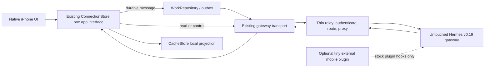
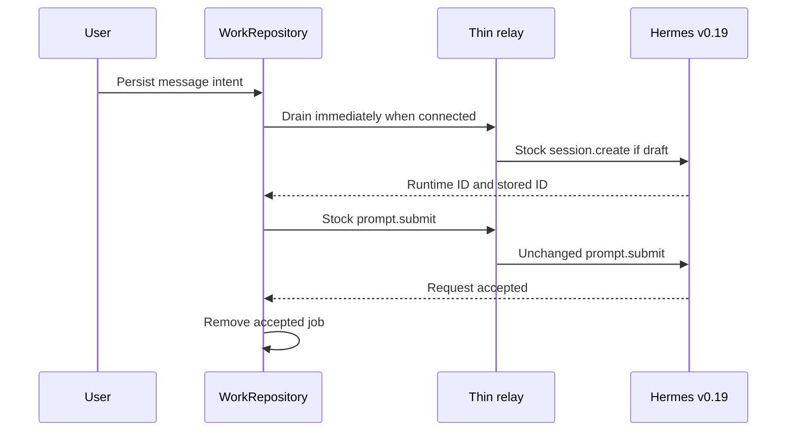
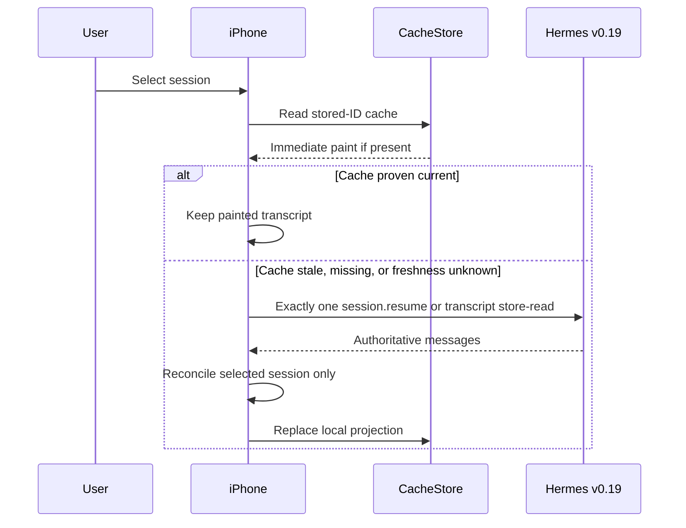

# ABH-519 — Hermes v0.19 mobile simplification proposal

**Status:** discussion proposal for independent review; no implementation is included.

**Branch:** `codex/abh-519-v019-simplification-note`, based on the Round 2 handoff branch at `5cb0169c2`.

**Related evidence:** `docs/CODEX-ABH519-ROUND2-HANDOFF.md`, ABH-519, ABH-516, ABH-401.

## Purpose

Build 120 fixed the original draft-born blank/cross-session-bleed defect, but device QA exposed more failures in the custom relay transcript path: the assistant response was not persisted, an answer could be typed as a tool item and fold into the working section, stored/runtime session identities diverged, foreign sessions stayed stale, and session switching could raise 4007.

Those findings are valid. The prior Round 2 plan, however, fixes each failure inside a second mobile-specific session/event system. This proposal takes the opposite direction: stop extending that system, use official Hermes v0.19 as the product and recovery boundary, and reduce the relay to an edge transport.

The objective is not stronger recovery than Hermes. It is a seamless and polished implementation of the behavior Hermes v0.19 already provides.

## Decisions already made

1. Official Hermes v0.19 is the reliability ceiling for now.
2. Permanent transcript state must recover; exact temporary tool/reasoning/progress cards do not need to survive a disconnect.
3. Do not build semantic replay or raw-frame replay.
4. Do not maintain a second relay transcript, session engine, item language, or stored/runtime identity system.
5. The iPhone uses one stock-gateway client path whether the gateway is reached directly or through the relay.
6. Every user message follows one durable send path through the existing WorkRepository/outbox, online or offline.
7. CacheStore is a local projection for instant/offline paint, never conversation truth.
8. The stock Hermes gateway remains authoritative and must not be patched for mobile behavior.

## Critical baseline correction

The Round 2 handoff branch is based on `f98610f9f` (build 120). It is not based on official Hermes v0.19:

- Official v0.19 is tag `v2026.7.20`, release commit `3ef6bbd201263d354fd83ec55b3c306ded2eb72a`.
- That commit is not an ancestor of the Round 2 handoff branch.
- Build 120 does not contain v0.19's `gateway/delivery_ledger.py`.

Therefore `docs/CODEX-ABH519-ROUND2-HANDOFF.md` is evidence of the current defects, not the final implementation plan or the correct future base.

Official release: <https://github.com/NousResearch/hermes-agent/releases/tag/v2026.7.20>

## Current architecture problem

```mermaid
flowchart LR
    UI["Native iPhone UI"] --> RC["RelayClient custom RPCs"]
    RC --> DS["Relay DownstreamServer"]
    DS --> GC["Relay GatewayClient wrappers"]
    GC --> GW["Hermes gateway"]

    GW --> GE["Raw gateway events"]
    GE --> RF["Relay Reframer"]
    RF --> RS["Relay session/transcript accumulator"]
    RS --> RI["Relay item frames"]
    RI --> IS["iOS RelayItemStore"]
    IS --> CO["RelaySessionCoordinator"]
    CO --> CS["ChatStore"]
    CS --> CA["CacheStore"]
```

The same conversation is modeled in the gateway, relay, and iPhone. Build 120's Q1/Q2/Q3 failures are disagreements between those copies, not independent product features.

The obvious alternate relay/iOS transport stack spans roughly 6,855 lines. This is not all automatically deletable, but it establishes that the relay is currently a second frontend protocol implementation rather than a thin edge.

## Target architecture

There is one public relay address and one logical iPhone connection. WebSocket and HTTP may remain internal wire mechanisms because stock Hermes already assigns them different jobs; they are not separate product backends.

### Normal wire use

- WebSocket JSON-RPC: session create/resume, prompt submission, controls, approvals and live events.
- HTTP through the same relay address: pairing/bootstrap, large uploads, passive/paginated transcript reads where stock Hermes already exposes the correct store-read endpoint.

The native UI does not select RestClient versus HermesGatewayClient. It calls the existing ConnectionStore. ConnectionStore hides those transport details.

`RelayClient` is not part of the target. The existing HermesGatewayClient connects to the relay URL and speaks the stock protocol unchanged.

## Component ownership

### Hermes v0.19 gateway

Owns:

- Permanent session and transcript truth.
- Runtime session creation/resume.
- Prompt execution.
- Attachments and interactive controls.
- Raw event production.
- The recovery and delivery semantics shipped by v0.19.

The mobile system must not rebuild these capabilities.

### Thin relay

Owns only edge concerns:

- Public TLS/network ingress.
- Pairing and phone/device authentication.
- Mapping an authenticated phone to its co-located gateway.
- Transparent proxying of stock WebSocket frames.
- Transparent proxying of an allowlisted set of stock/plugin HTTP routes.
- Connection lifetime and ordinary backpressure.

It does not own:

- Session history.
- Transcript items.
- Runtime-to-stored identity translation.
- Tool/reasoning reconstruction.
- Session open/resume policy.
- A second event vocabulary.

### iPhone

Owns:

- Native rendering through the existing GatewayEvent -> ChatStore reducer.
- CacheStore for instant/offline transcript paint.
- WorkRepository for unaccepted durable messages.
- Attachment staging/App Group storage.
- Local navigation and last-opened-session preferences.

### Optional mobile plugin

The plugin is not a network hop. It is an optional listener loaded inside the gateway process through official plugin APIs.

#### Important finding

The current `plugins/hermes-mobile` is not cleanly compatible with untouched official v0.19. It relies on fork-specific core seams that are absent from the v0.19 tag:

- `pre_emit_event`
- `post_emit_event`
- `post_frame_write`
- `on_ws_transport_change`
- `register_prompt_receipt_provider`
- Extra rich-device/socket registries in dashboard token authentication

Consequently the current plugin cannot simply be carried forward while claiming the stock gateway is unmodified.

#### Recommended plugin boundary

If product requirements need gateway-originated mobile behavior, replace the current plugin with a much smaller external plugin that uses only official v0.19 extension points:

1. APNs notification after a session finalizes, using stock `on_session_finalize`.
2. Optional approval observation using stock approval lifecycle hooks.
3. A small stock-mounted REST route for APNs token registration.

The plugin must be installed externally through normal Hermes plugin discovery. It must not live by patching files in the stock gateway checkout.

If notifications are required only for phone-originated turns and the relay remains attached until their terminal event, even this plugin may be unnecessary. The tradeoff is that desktop/CLI-originated completions would not automatically notify a disconnected phone.

### Capabilities deliberately removed or deferred

- Multi-client semantic event broadcast.
- Relay sync manifest.
- Relay transcript/session tables.
- Exact background approval recovery beyond what stock v0.19 exposes.
- Exact mid-turn visual recovery.
- Gateway-wide prompt receipt provider requiring a core registration seam.

These may be reconsidered only after the basic stock path is polished and a concrete user requirement proves they are necessary.

## One durable message path

All user messages should enter WorkRepository first, including online sends.

The online and offline send implementations must not diverge.

Reads and transient controls do not go through WorkRepository. A durable outbox is correct for work that must eventually execute; replaying an old session read or an old stop request later would be incorrect.

## New-chat flow

1. "New chat" creates a local draft only. It does not create an empty gateway row.
2. The first send is persisted into WorkRepository.
3. The drain explicitly calls stock `session.create`.
4. The phone records both returned identities: stored ID for durable UI/cache identity, runtime ID for live commands.
5. The drain calls stock `prompt.submit`.
6. Raw gateway events flow through GatewayEvent and ChatStore without reframing.
7. On authoritative `message.complete`, the final user/assistant text is saved to CacheStore under the stored ID.

The relay never creates a session secretly inside a nil-target custom submit.

## Session-open flow

Rules:

- Interactive open uses stock `session.resume`, which already returns messages and live status.
- Passive/older-page reads use the stock transcript HTTP endpoint.
- Do not perform custom `open` + `resume` + `history` chains.
- Cache paint never proves freshness by itself.
- No response from session A may write into the selected transcript after the user switches to session B.

## Recovery boundary

Official v0.19 improves permanent delivery/restart behavior, but it does not replay the exact WebSocket event stream. Its live resume snapshot contains accumulated user/assistant text and a streaming flag; cold resume restores persisted history, not every transient tool/reasoning card.

Accepted behavior after disconnect:

1. Reconnect the stock WebSocket.
2. Call stock `session.resume` for the selected stored session.
3. Repaint the permanent transcript and any basic in-flight text v0.19 returns.
4. Allow temporary tool/reasoning/progress cards to reset.

Do not add raw-frame replay or semantic replay.

The v0.19 delivery-obligation ledger primarily protects messaging-platform sends. The iPhone's recovery comes from the persisted gateway transcript plus `session.resume`; this proposal does not claim the delivery ledger directly supplies iOS WebSocket replay.

## Disposition of the Round 2 findings

| Round 2 finding | Final treatment |
|---|---|
| Q1: assistant completion is not cached | Keep the requirement, discard the relay-specific fix. Persist the settled text at the single raw `message.complete` seam under the stored ID. |
| Q2: answer delta can become a tool item | Delete the cause. Raw gateway events already carry their event type; do not patch RelayItemStore's unseen-delta heuristic. |
| Q3: stored/runtime mismatch and 4007 | Delete the custom identity lifecycle. Use identities returned by stock create/resume; do not restore relay `open` seed-binding. |
| Foreign desktop session paints stale cache | Remove the relay cache-hit short circuit. Compare freshness and perform exactly one authoritative refresh when stale/unknown. |
| "Load earlier messages" is a no-op | Fix independently through the existing stock paginated transcript read. |
| Device logs were unavailable | Retain as a release-process correction: use Console/device collection, `.default` diagnostics, or a pullable debug file. |

Do not implement the old Round 2 proposals to add turn-settle relay persistence, restore `client.open`, heal unseen relay item types, or add further runtime/stored-ID aliases. Those repair the system being removed.

## Code expected to disappear after proof

Relay side:

- `relay/hermes_relay/reframer.py`
- `relay/hermes_relay/session_state.py`
- Custom method vocabulary and translations in `downstream.py`, `gateway_client.py`, and `types.py`
- Relay-local submit deduplication
- Chat-state portions of `durable_state.py`, including attention, manifest-session, active-turn and owned-session copies
- Any notifier behavior replaced by the final relay/plugin decision

iOS side:

- `RelayItemStore.swift`
- `RelayClient.swift`
- Most or all of `RelaySessionCoordinator.swift`
- Relay-only branches in ConnectionStore, SessionStore, ChatStore, AttachmentStore, and control paths

The target must not permanently retain direct and relay protocols in parallel.

## Proposed implementation order

1. Establish an isolated baseline aligned to the exact official v0.19 tag. Preserve mobile app/edge work without carrying custom gateway-core patches by default.
2. Decide the minimum product requirement for disconnected push:
   - relay-only push for phone-originated turns; or
   - tiny external stock-compatible plugin for gateway-wide completion push.
3. Add a transparent stock WebSocket/HTTP proxy surface to the relay.
4. Point the existing HermesGatewayClient and RestClient at the relay address. Do not add another client abstraction.
5. Route every message through WorkRepository and explicit stock `session.create` -> `prompt.submit`.
6. Use the existing raw GatewayEvent -> ChatStore path.
7. Add only the narrow cache correction at stock `message.complete` and retain the existing cache-first/staleness reconcile.
8. Fix older-message pagination independently.
9. Prove the new vertical path on the physical device.
10. Delete the old relay item/session pipeline and its tests. Do not maintain dual writes.

This should be deletion-heavy. If implementation starts adding another coordinator, transcript store, replay type, identity map, or custom gateway method, stop and re-evaluate.

## Physical-device acceptance

Required on the iPhone Air:

- New chat sends once and begins rendering promptly.
- Final reply is a normal standalone assistant bubble.
- Switch away/back paints the same user and assistant transcript.
- Force-close/reopen paints the same session immediately from disk, then silently verifies freshness.
- A desktop-driven session refreshes to the current transcript on open/foreground.
- No cross-session messages.
- No normal-switch 4007.
- Offline message drains once after reconnection.
- A disconnect restores permanent transcript state; transient tool/reasoning cards are allowed to reset.
- "Load earlier messages" loads exactly one older page.
- Stock cwd, attachments, approval, interrupt, steer, slash and other RPCs work through the relay without custom relay handlers.
- A deliberately unavailable cache performs exactly one authoritative fetch and never paints another session's rows.

Evidence must be captured through a device logging channel that actually includes the selected log level. Simulator-only gates are insufficient.

## Non-negotiable guardrails

- No changes to the stock Hermes v0.19 gateway checkout.
- Any retained plugin installs externally and imports only public v0.19 plugin APIs.
- Plugin-disabled behavior remains stock.
- Relay failure or plugin failure cannot corrupt gateway conversation truth.
- No new transcript/session database in the relay.
- No semantic or raw-frame replay.
- No parallel permanent send implementations.
- No fifth patch whose only proof is simulator XCTest.

## Questions for the reviewing agent

1. Is there any basic iPhone chat requirement here that truly cannot be satisfied by stock v0.19 create/resume/submit/events plus cache/outbox?
2. Can disconnected completion push be limited to phone-originated turns, eliminating the plugin entirely, or is gateway-wide desktop/CLI completion push a product requirement?
3. If a tiny plugin remains, can every proposed behavior be implemented strictly through public v0.19 hooks (`on_session_finalize`, approval hooks, dashboard plugin mounting) with the official gateway tree unchanged?
4. What is the narrowest honest ambiguous-submit policy without the fork-only prompt-receipt provider: a bounded relay receipt keyed by `client_message_id`, or surfacing an uncertain state and reconciling before retry?
5. Does stock v0.19 support the required simultaneous desktop/phone behavior without event broadcast? If not, can the basic product use refresh-on-open/foreground instead of live background mirroring?
6. Which existing relay/plugin features are genuinely user-critical for the first polished version, rather than capabilities we are preserving because they already exist?

The reviewer should challenge any retained component that is not necessary for the basic user experience: send, stream, switch, reopen, resume, and notify.
