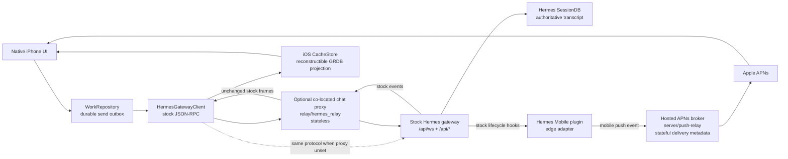
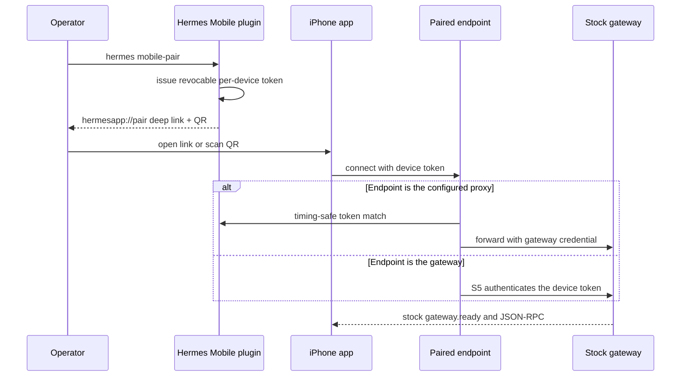
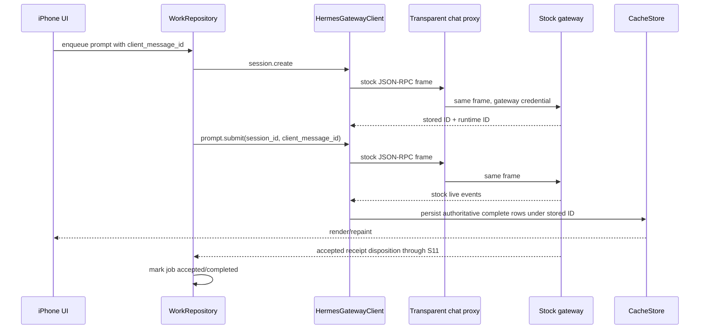
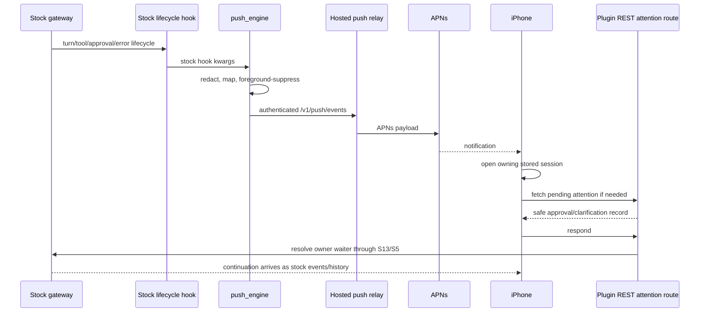

# Hermes Mobile native-stock architecture handoff

**Prepared:** 2026-07-24

**Review branch:** `codex/native-stock-architecture`

**Draft PR:** [#243 — refactor(mobile): adopt stock notification and session architecture](https://github.com/abhibansal-sg/hermes-mobile/pull/243)

**Stock-hook implementation:** `2dae8d44c`

**Duplicate-path deletion:** `d40a7971b`

**Finalize-oracle correction:** `a68ce0dca`

**Independent-review correction:** `2eba1915d`

**PR merge base / current `origin/main`:** `f890a1d12dec7763ea61c55861d441c60240d9a7`

This is the reviewer handoff for the complete Hermes Mobile simplification
exercise. In this document, “custom scene” is interpreted as **custom seam**:
a deliberate, generic addition inside stock Hermes core that the external
Hermes Mobile plugin cannot implement by itself.

## Executive result

The mobile chat architecture now has one conversation protocol:

1. iOS creates, resumes, watches, submits, interrupts, and receives live events
   through the stock Hermes JSON-RPC protocol.
2. When configured, the co-located chat relay authenticates and forwards stock
   WebSocket/HTTP traffic without parsing or translating it. Without the
   optional proxy address, iOS uses the paired gateway address with the same
   stock protocol.
3. The stock gateway remains the authoritative owner of conversations,
   transcripts, live runtimes, and events.
4. iOS keeps only a durable send outbox and a reconstructible local cache.
5. Mobile-only edge behavior lives in `plugins/hermes-mobile`.
6. Five generic core seams remain: S4, S5, S6, S11, and S13.

The current PR is a net-deletion of the second frame-delivery/replay/status
architecture. The review correction deletes another 652 lines while adding
146 lines for corrected tests, truthful metadata, and one generic S5 checker.

This PR is not merged or released by this handoff. It did not modify the live
gateway, live relay, production configuration, TestFlight, or `main`.

## The whole system at a glance

There are two different services historically called “relay.” They must not be
treated as one component:



### Component ownership

| Component | Owns | Explicitly does not own |
|---|---|---|
| Stock Hermes gateway | Durable sessions, transcript, live runtime, drive ownership, stock RPC/event semantics | APNs registration, iOS cache, mobile credentials |
| `plugins/hermes-mobile` | Pairing, device tokens, mobile REST routes, prompt receipts, pending-attention projection, approval audit, push/Live Activity adaptation | Chat transcript, a second gateway protocol, frame replay |
| `relay/hermes_relay` | Optional local phone authentication, upstream credential substitution, byte-transparent WS/HTTP proxying | Sessions, transcripts, event translation, replay, SQLite |
| `server/push-relay` | Agent/device enrollment, APNs tokens/preferences, push delivery metadata, APNs delivery | Hermes conversations or transcripts |
| iOS `WorkRepository` | Durable user intent and retry state | Render truth |
| iOS `CacheStore` | Fast local paint, offline search, project/session projections | Authoritative server truth |
| iOS stores/UI | Selection, drive/watch policy, rendering stock events, local interaction state | Server session persistence |

## What “the adapter” means now

The adapter is the external plugin in
[`plugins/hermes-mobile/`](../plugins/hermes-mobile/). It is loaded by the
stock plugin manager and uses the stock dashboard router and CLI command
registration surfaces.

It contains five categories of behavior.

### 1. Stock lifecycle hooks to mobile push

[`push_engine.py`](../plugins/hermes-mobile/push_engine.py) registers:

| Stock hook | Mobile edge interpretation |
|---|---|
| `pre_llm_call` | Turn started; begin/update Live Activity |
| `post_llm_call` | Final reply ready; completion push and transcript invalidation |
| `on_session_end` | Interrupted-turn cleanup |
| `pre_tool_call` | Tool activity, or clarification request |
| `post_tool_call` | Tool completion, or clarification resolved |
| `api_request_error` | Non-retryable provider error |
| `pre_approval_request` | Redacted actionable approval push |
| `post_approval_response` | Approval resolved and activity returns to thinking |
| `on_session_finalize` | Durable-ID Live Activity cleanup fallback |

The adapter keeps a bounded in-process turn-start map so it can calculate
activity timing and suppress unrelated callbacks. These event names are
internal to the push adapter; they are not a second chat wire protocol.

The final completion hook is `post_llm_call`, emitted by the stock turn
finalizer. `on_session_finalize` is not used as a turn-complete event.

### 2. Mobile REST edge

[`dashboard/api.py`](../plugins/hermes-mobile/dashboard/api.py) is mounted at
`/api/plugins/hermes-mobile/` and exposes:

- attachment upload/fetch;
- pending attention and approval/clarification response;
- debug sharing;
- device issue/list/revoke/foreground;
- approval audit;
- sandboxed file list/read/diff;
- hosted-relay pairing;
- APNs and Live Activity token registration;
- session search and paginated transcript reads;
- artifact gallery;
- toolset/provider configuration;
- memory approval/configuration.

This is a wide mobile product edge, but it is outside Hermes core. A reviewer
should distinguish “outside core” from “strictly required by ABH-519”: not
every route is part of chat/session correctness.

### 3. Pairing and device identity

[`mobile_pair.py`](../plugins/hermes-mobile/mobile_pair.py) registers the
stock CLI command:

```text
hermes mobile-pair
```

The direct pairing path is:



[`device_tokens.py`](../plugins/hermes-mobile/device_tokens.py) persists only
hashed per-device credentials in `<HERMES_HOME>/device_tokens.json`. It also
keeps bounded process-local maps for open device sockets, foreground session
selection, and runtime-to-device correlation. Revocation closes indexed
device sockets; shared-token sockets are not indexed as devices.

The former hosted `kind=relay` setup link was a dead end: the plugin minted it
and iOS parsed it, but the app never applied it. That route, parser branch, and
tests are now deleted. Hosted push enrollment remains separate from the direct
gateway/device-token pairing flow above.

### 4. Durable sends and pending interactions

[`prompt_receipts.py`](../plugins/hermes-mobile/prompt_receipts.py) owns the
profile-scoped SQLite receipt provider used by S11. It reserves a
`client_message_id` before prompt mutation and records the accepted
disposition so an ambiguous retry is deduplicated.

[`pending_attention.py`](../plugins/hermes-mobile/pending_attention.py) reads
the safe owner snapshots exposed by S13 and builds an authorization-partitioned
full snapshot or bounded delta with signed cursors and tombstones. It does not
own the approval or clarification waiters.

[`audit_log.py`](../plugins/hermes-mobile/audit_log.py) records the identity of
the REST/WS device that actually resolved an approval. Stock pre/post approval
hooks run in the waiting thread and cannot supply resolver identity, so this
uses the generic S5 resolve-observer context.

### 5. Other plugin-local policy/helpers

- [`manifest_invalidation.py`](../plugins/hermes-mobile/manifest_invalidation.py)
  keeps a coalesced revision journal and emits silent refresh pushes.
- [`transcript_sync.py`](../plugins/hermes-mobile/transcript_sync.py) shapes
  bounded REST transcript pages; it is not a transcript store.
- [`ios_turn_context.py`](../plugins/hermes-mobile/ios_turn_context.py) injects
  concise mobile-output guidance only for authenticated mobile turns.
- [`gitbranch.py`](../plugins/hermes-mobile/gitbranch.py) is a small branch
  lookup helper.

The mobile-output hook is an explicit presentation policy of the iOS adapter,
not transport behavior. Stock Hermes injects its return value only into the
current API-call copy of the user message (`agent/turn_context.py` and
`agent/conversation_loop.py`); it does not mutate history or the cached system
prompt, so the stable prompt-cache prefix is preserved. The unrelated
`kanban_spec_guard` policy and its tests were removed from this adapter.

## What remains custom inside Hermes core

The adapter is not completely zero-seam. The current
[`CONTRACT-DEPATCH.md`](../CONTRACT-DEPATCH.md) retains exactly five generic
host seams.

| Seam | Core files | What core exposes | What stays in the plugin | Why stock v0.19 is insufficient |
|---|---|---|---|---|
| S4 | `tui_gateway/server.py` | Session-scoped `fast` override carried through create/config/agent build | No mobile state | Stock has session model/reasoning overrides, but not the complete hot fast-tier override path |
| S5 | `hermes_cli/dashboard_auth/token_auth.py` plus guarded dashboard/WS/resolver call sites | Generic token authenticators, identity validators, socket observers, session-ownership checkers, resolver identity context | Device registry, hash policy, liveness, revoke races, socket index, the only device/session owner map, audit record | Stock auth providers do not cover WS tickets, live revocation, rich identity metadata, socket lifecycle, resource ownership, and resolver identity end-to-end |
| S6 | `tui_gateway/server.py` | `session.delete` safely interrupts/tears down a matching live runtime and reports `evicted` | Nothing mobile-specific | Stock returns 4023 rather than deleting a live session |
| S11 | `tui_gateway/server.py` | Structural prompt-receipt provider registry and pre-mutation call | SQLite schema, scoping, retention, liveness and disposition | Stock `prompt.submit` has no durable idempotency receipt |
| S13 | `tools/approval.py`, `tui_gateway/server.py` | Lock-safe redacted pending approval/clarification snapshots, clarification resolver, resolve observers | Auth visibility, signed cursors, bounded delta/tombstones, REST route | The waiter maps and locks are private to core and cannot be safely reconstructed by a plugin |

These seams are intentionally provider-neutral and are candidates for
upstreaming independently. They must not import Hermes Mobile, APNs, GRDB, or
mobile paths.

### S5 audit result

The retained S5 call sites carry only an authenticated identity dictionary,
scope checks, ticket metadata, socket lifecycle notifications, and a generic
session-ownership question. The ownership check previously imported
`hermes_plugins.hermes_mobile.device_tokens` from `tui_gateway/server.py`;
that dependency is removed. `token_auth.py` now exposes the checker registry,
and the plugin answers from its existing bounded owner map.

There is no credential database, revocation index, device/session map, APNs
policy, or Hermes Mobile import in core. With the plugin absent all four S5
registries are empty, rich-token authentication fails closed, and stock shared
dashboard/session authentication remains unchanged.

### Behavior on pristine public v0.19

The plugin **registers without crashing** on pristine public v0.19 because
optional registries are feature-detected. That is loading compatibility, not
full feature parity:

- no S11 means `client_message_id` has no durable gateway receipt;
- no S5 means the complete device-token WS/ticket/revocation lifecycle is
  unavailable;
- no S13 means watched-session attention reconciliation/response is
  unavailable;
- no S6 means live delete retains stock 4023 behavior;
- no S4 means the full per-session fast override behavior is unavailable.

Do not summarize the current result as “the plugin needs no Hermes changes.”
The accurate statement is: **chat and notification semantics use stock
protocols/hooks; five narrow generic host seams remain.**

## What was deleted

The current PR removes:

- plugin gateway-frame observer intake;
- plugin broadcast/fan-out engine;
- plugin replay ring;
- the external watcher script;
- gateway observer executor and frame observer hooks;
- iOS structured `session.status` model and fallback call;
- old status fixtures and observer/replay/broadcast tests;
- stale monolithic `scripts/seams.patch`.

The seam ledger now records:

- S1 foreign-frame fan-out — removed;
- S2 frame observation/transformation — removed;
- S3 custom finalize metadata — superseded;
- S7 custom WebSocket transport — superseded by stock;
- S8 source filtering — upstream;
- S9 desktop foreign-frame adoption — obsolete;
- S10 old REST live-delete/embedded guards — obsolete or folded into S6;
- S12 structured machine `session.status` — removed.

No second chat protocol, transcript, replay ring, semantic relay session, or
custom status vocabulary should survive this PR.

## End-to-end chat flow

### New chat and first send



The durable stored ID is the cache/UI identity. The runtime ID is the live
command target. They are not interchangeable.

### Open, drive, and watch

Before resuming an existing session, iOS calls stock
`session.active_list`:

- if another client is actively driving the session, the phone enters
  **watch** mode and does not call `session.resume`;
- otherwise the phone may **drive** by calling `session.resume`;
- a deliberate submit from a watched session is the ownership transition.

This avoids stock resume’s ownership-rebind behavior stealing a desktop/CLI
runtime. The resume response supplies the stock `running`, status, and bounded
inflight snapshot. `session.usage` seeds the context meter. There is no custom
`session.status` RPC.

### Switching and force-close

1. Selection changes to a stored session ID.
2. `CacheStore` paints that exact `(server, profile, stored session)` scope.
3. Network reconciliation uses stock resume/history semantics appropriate to
   drive/watch.
4. Authoritative complete events rewrite the same scoped cache rows.
5. After process death, the same stored ID repaints from GRDB before network
   reconciliation.

The gateway transcript remains authoritative. The cache is deliberately
reconstructible and cache failure remains non-fatal.

## Notification and attention flow



The hosted push relay stores delivery metadata, not conversation data. It may
forward title/body copy depending on its privacy configuration.

## Every durable store and what it means

### Stock gateway

The Hermes `SessionDB` and session transcript files are authoritative. The
live `tui_gateway.server._sessions` map is process-local runtime state, not a
second durable transcript.

### iOS cache database

[`CacheSchema.swift`](../apps/ios/HermesMobile/Cache/CacheSchema.swift) contains:

| Table | Purpose |
|---|---|
| `session_cache` | Scoped drawer/session summaries |
| `message_row_cache` | Scoped rendered transcript rows |
| `sync_meta` | Cache schema/bookkeeping |
| `offline_message_cache` | Scope-safe offline transcript mirror |
| `transcript_fts` | Offline full-text search |
| `offline_search_backfill` | Search backfill progress |
| `manifest_scope_state` | Server manifest/cursor metadata |
| `pending_attention_cache` | Killed-app approval/clarification projection |
| `attention_reconciliation_meta` | Attention cursor/instance metadata |
| `active_turn_cache` | Reconstructible active-turn projection |
| `transcript_head_cache` | Reconstructible transcript-head projection |
| `last_opened_session` | Last stored session by server/manifest scope |
| `project_cache` | Cache-first project list |
| `project_session_cache` | Cache-first sessions within a project |
| `attachment_blob` | Local attachment blob cache |

The migrated schema repairs the Apple SQLite foreign-key rename behavior that
caused populated device databases to fail while fresh simulator databases
passed.

### iOS work database

[`WorkSchema.swift`](../apps/ios/HermesMobile/Work/WorkSchema.swift) contains:

| Table | Purpose |
|---|---|
| `drafts` | Durable composer state by server/profile/context |
| `work_jobs` | Prompt/share/App Intent jobs and retry/acceptance lifecycle |
| `work_assets` | Local asset metadata |
| `job_assets` | Ordered assets attached to a queued job |
| `draft_assets` | Ordered assets attached to a draft |
| `transfers` | Background upload/download state |

This database owns user intent until the gateway gives an authoritative
acceptance disposition. It is not used to reconstruct agent replies.

### Plugin-local storage

| Store | Purpose |
|---|---|
| `<HERMES_HOME>/device_tokens.json` | Hashed revocable device credentials |
| `<profile>/plugins/hermes-mobile/prompt_receipts.sqlite3` / `prompt_receipts` | S11 idempotency reservations/dispositions |
| approval audit file | Bounded resolver audit trail |
| `mobile_manifest_revisions.json` | Coalesced silent-refresh revisions |
| `<HERMES_HOME>/push/relay.json` | Hosted push-relay agent credentials/pairing |

Pending-attention cursor journals, foreground maps, live socket indexes, and
turn-start tracking are bounded process-local state.

### Hosted APNs broker

[`server/push-relay/`](../server/push-relay/) has its own SQLite store:

| Table | Purpose |
|---|---|
| `agents` | Anonymous gateway/plugin identity and hashed credentials/pairing |
| `devices` | APNs tokens, environment, bundle ID, notification preferences |
| `push_events` | Delivery metadata |
| `attest_challenges` | App Attest challenge replay protection |
| `transit` | Broker tunnel/transit state |

It does not store Hermes sessions or transcripts.

The broker README still says “Fetch Push Relay” and uses some `HERMES_FETCH_*`
examples. That naming is inherited reuse, not the current Hermes Mobile product
boundary, and should be reviewed/cleaned separately rather than hidden.

## Work completed before this PR

The recorded ABH-519 sequence is:

1. **Phase 0:** proved a pullable physical-device logging channel.
2. **Phase 1:** added the authenticated transparent stock WS/HTTP proxy and
   proved unchanged stock frames against an isolated gateway.
3. **Phase 2:** moved the iOS vertical slice to explicit stock
   `session.create` → `prompt.submit`, stored/runtime identity, and drive/watch;
   proved cache write/HIT/repaint on device.
4. **Phase 3:** proved parity for live follow, approvals, clarifications,
   pagination, push navigation, and foreground suppression using retained
   seams.
5. **Phase 4:** deleted the legacy item-stream/reframer/session-state stack and
   retained one stock gateway protocol.
6. **Post-merge hardening:** routed watched-session approval/clarification
   responses through S13, tightened ACK-only clearing, and ran two-device
   physical gates.
7. **PR #241/main consolidation:** removed further divergent project/session
   paths.
8. **PR #243/current:** replaces the last frame-observer notification intake
   with stock hooks and deletes S1/S2/replay/status remnants.

Evidence:

- [`ABH519-PHASE0-DEVICE-LOG-EVIDENCE.md`](ABH519-PHASE0-DEVICE-LOG-EVIDENCE.md)
- [`ABH519-PHASE1-TRANSPARENT-PROXY-EVIDENCE.md`](ABH519-PHASE1-TRANSPARENT-PROXY-EVIDENCE.md)
- [`ABH519-PHASE2-IOS-VERTICAL-SLICE-EVIDENCE.md`](ABH519-PHASE2-IOS-VERTICAL-SLICE-EVIDENCE.md)
- [`ABH519-PHASE3-PARITY-EVIDENCE.md`](ABH519-PHASE3-PARITY-EVIDENCE.md)
- [`ABH519-PHASE4-DELETION-EVIDENCE.md`](ABH519-PHASE4-DELETION-EVIDENCE.md)
- [`ABH519-POST-MERGE-HARDENING-EVIDENCE.md`](ABH519-POST-MERGE-HARDENING-EVIDENCE.md)
- [`STOCK-PROTOCOL-MAP.md`](STOCK-PROTOCOL-MAP.md)
- [`CONTRACT-DEPATCH.md`](../CONTRACT-DEPATCH.md)

The Phase 3 document describes S1/S2 as retained at that historical point.
PR #243 intentionally supersedes that part of the Phase 3 architecture; its
device results remain historical evidence, not proof of the new stock-hook
push intake.

## Current PR verification

Recorded before the independent-review correction:

- physical iPhone 16 Pro Max:
  `LiveTurnReentryTests` and `ContextMeterTests` passed;
- plugin registration against pristine public v0.19 passed.

Re-run on review-correction code head `2eba1915d`, after rebasing onto current
main:

- relay suite: **27 passed**;
- stock-hook notification/registration/Live Activity slice: **63 passed**;
- finalize/lazy-session regression file: **18 passed**;
- S5 auth, ticket, ownership, and plugin-wiring slices: **102 passed**;
- complete mobile-plugin sweep: **624 passed**, with only the known
  owner-configuration-sensitive provider assertion failing;
- that provider assertion passed in an isolated `HERMES_HOME`: **1 passed**;
- Python compile and `git diff --check` passed.

Re-run on final review-correction code head `518fde7e4`:

- physical completion APNs opened and painted the owning session: green;
- physical actionable approval APNs opened the owning gate, resumed the turn,
  and painted the final answer: green;
- physical `NotificationLaunchCoordinatorTests` +
  `NotificationActionTests`: green;
- physical `LiveTurnReentryTests` + `ContextMeterTests`: green.

The exact commands, runtime/stored IDs, timestamps, markers, broker rows, and
artifact paths are recorded in
[`PR243-CURRENT-HEAD-PHYSICAL-PUSH-EVIDENCE.md`](PR243-CURRENT-HEAD-PHYSICAL-PUSH-EVIDENCE.md).

## Important limits and open review findings

1. **Current-head physical APNs proof is green.** Completion opened and painted
   the owning session. An actionable approval opened the owning gate, resumed
   the blocked turn, and painted the final answer. The gate exposed one real
   missing edge: foreground completion APNs was presented but did not reconcile
   the active transcript. `518fde7e4` now routes that existing notification
   edge through the existing one-shot backfill and drawer refresh.
2. **The four stale Live Activity mocks are corrected.** They now accept the
   real notifier priority and drive completion/finalize through stock hook
   entry points. The focused suite is green.
3. **S5 remains the broadest retained core seam and has been audited.** One
   direct core-to-plugin ownership import was found and replaced by a generic
   checker beside the existing auth registries. The plugin still owns all
   credential, revocation, socket-index, and session-owner state.
4. **The manifest hook declaration is corrected.** `provides_hooks` is
   informational in the stock plugin manager rather than an enforcement gate,
   but it now lists every hook name dynamically registered by the adapter so
   metadata cannot silently drift.
5. **The hosted broker retains Fetch naming and tunnel capabilities.** Confirm
   which hosted functions Hermes Mobile actually deploys; do not accidentally
   merge the stateful APNs broker with the stateless co-located chat proxy.
   The current hosted deployment rejects `ai.hermes.app` as an unsupported
   bundle ID even though repository source allows it. This is a separate
   deployment prerequisite; the current-head device gate used repository
   `server/push-relay` locally with real sandbox APNs and changed no hosted
   service.
6. **The dormant hosted `kind=relay` pairing path was deleted.** The stateful
   hosted push broker remains separate from the stateless chat proxy; no
   minted-but-ignored mobile pairing link remains.
7. **`ios_turn_context` is presentation policy, not transport.** Its scope is
   explicit in the plugin manifest. Stock pre-LLM context injection changes
   only the current API-call user-message copy, preserving history and the
   byte-stable cached system prompt. The unrelated `kanban_spec_guard` was
   deleted from this adapter.
8. **Pristine-stock registration is graceful degradation, not zero-seam
   parity.** Test both “loads” and the actual absence behavior for each optional
   seam.
9. **The branch is rebased onto `f890a1d12`.** Range-diff preserved the four
   original changes, and the main commit touched adjacent iOS views/support
   rather than the branch’s protocol/store files. The physical iOS gates were
   rerun on final correction head `518fde7e4`.
10. **No live production validation belongs to this branch.** Production
   gateway wiring, TestFlight release, and owner data truth must be a separate,
   explicitly approved deployment gate.

## Reviewer reproduction commands

Run from an isolated checkout of `codex/native-stock-architecture`.

```sh
git fetch origin
git diff --stat origin/main...origin/codex/native-stock-architecture
git diff --check origin/main...origin/codex/native-stock-architecture
git log --oneline origin/main..origin/codex/native-stock-architecture
```

Verify relay transparency and absence of state/translation:

```sh
PYTHONPATH=relay python -m pytest -q relay/tests
git diff -U0 origin/main...HEAD -- relay/hermes_relay |
  rg '^\\+[^+].*(json\\.loads|json\\.dumps|sqlite|transcript|replay|reframe|session_state)'
```

Verify the removed observer/replay architecture stays absent:

```sh
rg -n 'FRAME_OBSERVERS|POST_EMIT_EVENT_OBSERVERS|broadcast|ReplayRing|replay_ring' \
  tui_gateway hermes_cli plugins/hermes-mobile relay
```

Verify stock-hook notification wiring:

```sh
python -m pytest -q \
  tests/plugins/hermes_mobile/test_push_intake.py \
  plugins/hermes-mobile/tests/test_push_alert_event_kinds.py \
  plugins/hermes-mobile/tests/test_register_late_wiring.py \
  tests/plugins/hermes_mobile/test_plugin_register.py
```

Verify the corrected finalize contract:

```sh
python -m pytest -q tests/test_lazy_session_regressions.py
```

Inspect retained seams directly:

```sh
rg -n \
  'create_service_tier_override|TOKEN_AUTHENTICATORS|IDENTITY_VALIDATORS|SOCKET_OBSERVERS|PROMPT_RECEIPT_PROVIDERS|pending_approval_snapshot|pending_prompt_snapshot|evicted' \
  tui_gateway hermes_cli tools
```

For iOS, use physical hardware and the repository mutex wrapper only:

```sh
scripts/ios-build.sh test \
  -scheme HermesMobile \
  -destination 'platform=iOS,id=<PHYSICAL_DEVICE_UDID>' \
  -collect-test-diagnostics never
```

Do not use the live gateway/relay for review. Use isolated gateway ports 9130+
and an isolated proxy. Do not start a simulator on the owner’s Mac Studio.

## Requested independent review

Please review, in this order:

1. Confirm the co-located relay is truly byte-transparent and stateless.
2. Confirm stock RPC/event semantics are the only chat protocol used by iOS.
3. Confirm S1, S2, S3, S7, S9, S10, and S12 have no surviving runtime
   implementation.
4. Audit S4/S5/S6/S11/S13 for genericity, minimum footprint, and graceful
   plugin-disabled behavior.
5. Trace one new-chat send from `WorkRepository` through stock
   `session.create`/`prompt.submit` to scoped cache persistence.
6. Trace drive/watch and prove `session.active_list` cannot steal a foreign
   runtime.
7. Trace completion, approval, clarification, error, and interrupt push from
   the exact stock hook to APNs.
8. Confirm the retained `ios_turn_context` stays limited to authenticated
   mobile turns and continues to use stock cache-safe user-message injection.
9. Distinguish and audit the stateless chat proxy and stateful APNs broker as
   separate systems; the unused cross-system `kind=relay` pairing path is gone.
10. Require current-head physical notification evidence before approval.

The acceptance standard is architectural deletion, not merely passing tests:
no new coordinator, transcript store, replay type, identity map beyond the
single stored/runtime owner binding, custom gateway method, or second
implementation of existing stock behavior.
